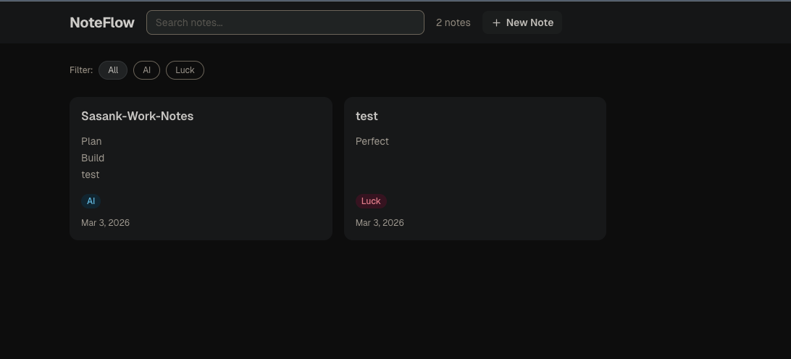

# NoteFlow

A minimal, fast notes manager built with Next.js, React 19, and SQLite.

## Test Run Screenshot



## Features

- Create, edit, and delete notes
- Pin important notes to the top
- Tag notes and filter by tag
- Color-coded note accents
- Full-text search
- Dark theme

## Tech Stack

- **Next.js 16** with App Router and Server Actions
- **React 19**
- **SQLite** via `better-sqlite3`
- **Tailwind CSS v4**
- **TypeScript**

## Getting Started

```bash
npm install
npm run dev
```

Open [http://localhost:3000](http://localhost:3000) in your browser.

## Docker

```bash
docker compose up
```

The SQLite database is persisted in a Docker volume at `/data/noteflow.db`.
